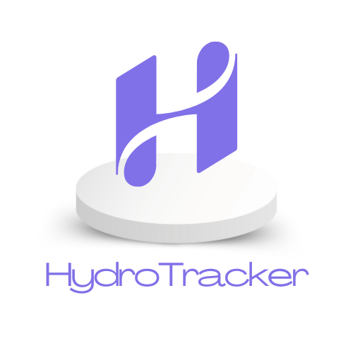

# 💧 HydroTracker - Smart Water Cup Monitor for Cafés
<p align="center">
  
</p>


HydroTracker is a smart hydration monitoring system originally designed to encourage water intake in work environments, now adapted into a **real-time service assistant** for **cafés**. It helps waitstaff **identify when customers' glasses are empty** and notifies them instantly—improving both **efficiency** and **customer experience**.

---

## 🚀 Project Overview

The idea began with a smart base (coaster) that uses a weight sensor to monitor the **daily water consumption** of users. Over time, the system evolved into a scalable solution for the **hospitality industry**, particularly cafés and restaurants.

Instead of waiters constantly checking glasses, HydroTracker lets them know **exactly when a refill is needed**, thanks to an intelligent network of coasters.

---

## 🎯 Use Case

> 💡 **Target audience**: Cafés and hospitality venues aiming to enhance service automation and hydration awareness.

Each coaster uses a **load cell sensor** connected to an **Arduino Uno** to detect changes in weight. When a glass is detected as **empty**, the node wirelessly transmits a message to a central receiver, which relays the update to a GUI system via serial communication.

---

## 🧠 Project Structure
```
📦 Hydrotracker
├── 📁 media # Videos, promo material, demo shots
│ ├── 📁 demo
│ └── 📁 promo
├── 📁 src # Main source code (Python, Arduino)
│ ├── 📁 data_processing
│ └── 📁 networking
├── 📁 docs # Documentation and reports
│ ├── 📁 assets
│   ├── 📁 gui_images
│   ├── 📁 load cell images
│   ├── 📁 setup_images
|   ├── 📁 business_images
│ └── 📁 report
├── 📁 3d_prints # 3D-printable .stl files
```
---

## 🛠️ Hardware Used

- 🧠 **Arduino Uno** – used in both nodes and central receiver  
- ⚖️ **3kg Load Cell** – detects weight of the glass  
- 🔊 **HX711 Amplifier Module** – reads and amplifies sensor output  
- 📡 **RFM22 ISM Transceiver Module** – enables node-to-node communication  
- 🧩 **Breadboard & Jumper Wires**  
- 🖨️ **3D-Printed Cup Base** – physically holds the sensor and glass  

---

## 📐 System Functionality

### 🧪 Sensor Logic

- Load cell detects the **weight** of the glass
- Readings are amplified and interpreted on the Arduino node
- If weight is below a threshold for a set time → considered **empty**

### 🔔 Notification & Communication

- Node sends signal via **ALOHA-style RF protocol**
- Central receiver aggregates messages and sends them to host PC
- The PC displays each node’s state (e.g., FULL / EMPTY) in a **GUI dashboard**
- Colored indicators show the status (e.g., 🟢 full, 🔴 empty)

---

## 📸 Media & Demo

The `media/` folder includes:
  
- 🎥 Demo video showing the system in action  
- 🖼️ Slides for presentations 
- 🎥 Promo video  

### ▶️ Watch Videos

🔧 Real-time demo of HydroTracker in action: [Demo Video](https://www.youtube.com/watch?v=DEMO_VIDEO_ID)

🎬 Promotional overview for cafés: [Promo Video](https://www.youtube.com/watch?v=PROMO_VIDEO_ID)

> Made with ☕ and 💡 by Team HydroTracker – Aristotle University of Thessaloniki  
